# 實驗室 04：開始在 Fabric 中構建 ML 模型

**導言**

作為場景的複習，AbboCost Financial
一直在為其財務分析師更新股票市場報告。在之前的模組中，我們已經通過創建即時儀錶盤、資料
Warehouse 等方式開發了解決方案。

在本模組中，AbboCost
希望探索預測分析方法，以説明為其顧問提供資訊。我們的目標是分析歷史資料，找出可用于創建未來價值預測的模式。Microsoft
Fabric 的 Data Science 功能是進行此類探索的理想場所。

**目標**

- 導入和配置用於構建和存儲機器學習模型的筆記本。

- 探索和執行 DS 1-Build Model 筆記本，以建立和驗證股票預測模型。

- 檢查 RealTimeWorkspace 中的模型中繼資料和性能指標。

- 打開並流覽 DS 2-Predict Stock Prices 筆記本，預測股票價格。

- 運行用於生成預測並將其存儲到 Lakehouse 的筆記本。

- 導入並探索 DS 3-Forecast All 筆記本，用於生成預測並將其存儲在
  Lakehouse 中。

- 執行筆記本並驗證 Lakehouse 模式中的預測。

- 使用 StockLakehousePredictions 資料在 Power BI 中建立語義模型，並在
  Power BI 中創建視覺化來分析股票預測和市場趨勢。

- 配置表之間的關係並發佈預測報告。

# 練習 1：構建和存儲 ML Model

## 任務 -1: 導入筆記本

1.  在 **StockDimensionalModel** 頁面中，按一下左側導航菜單上的
    **RealTimeWorkspace**。

2.  在 **Synapse Data Engineering RealTimeWorkspace**
    頁面，導航並按一下**導入**按鈕，然後選擇**筆記本**並選擇**從這台電腦**，**如下圖所示。**

3.  在右側出現的 "**導入狀態** "窗格中，按一下 "**上傳**"。

4.  導航至 **C:\LabFiles\Lab 05** 並選擇 **DS 1-構建模型、DS
    2-預測股票價格和 DS 3-預測所有**筆記本，然後按一下 "**打開 "**按鈕。

5.  您將看到一條通知，說明 "**導入成功"。**

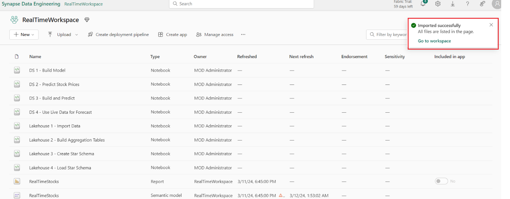

6.  在 **RealTimeWorkspace** 中，按一下 **DS 1-Build Model** 筆記本。

7.  在 "資源管理器 "下，選擇 **Lakehouse** 並按一下 "**添加**
    "**按鈕。**

> ***重要*提示：**您需要為每本導入的筆記本添加 Lakehouse --
> 每次首次打開筆記本時都要這樣做。

8.  在 **"添加 Lakehouse** "對話方塊中，選擇 "**現有 Lakehouse**
    "選項按鈕，然後按一下 "**添加** "按鈕。

9.  在 OneLake 資料中心視窗，選擇 ***StockLakehouse***
    並點擊**添加**按鈕。

## 任務 2：探索和運行筆記本

*DS 1* 筆記本在整個筆記本中都有記錄，但簡而言之，該筆記本執行以下任務：

- 允許我們配置要分析的股票（如 WHO 或 IDGD）

- 以 CSV 格式下載歷史資料進行分析

- 將資料讀入資料幀

- 完成一些基本的資料清理工作

- 負載[先知](https://facebook.github.io/prophet/)，用於進行時間序列分析和預測的模組

- 根據歷史資料建立模型

- 驗證模型

- 使用 MLflow 存儲模型

- 完成未來預測

生成股票資料的程式在很大程度上是隨機的，但應該會出現一些趨勢。因為我們不知道你什麼時候會做這個實驗，所以我們生成了幾年的資料。筆記本將載入這些資料，並在構建
Model 時截斷未來的資料。作為整體解決方案的一部分，我們會在 Lakehouse
中用新的即時資料補充歷史資料，必要時（每天/每週/每月）重新訓練模型。

1.  在 1^(st) 儲存格中，取消 STOCK_SYMBOL="IDGD" 和
    STOCK_SYMBOL="BCUZ"，然後選擇並**運行**該儲存格。

2.  按一下頂部工具列中的 "***全部運行***"，跟隨工作的進展。

3.  該筆記本大約需要 **15-20** 分鐘來執行 --
    某些步驟，如**模型訓練**和**交叉驗證**，需要一些時間。

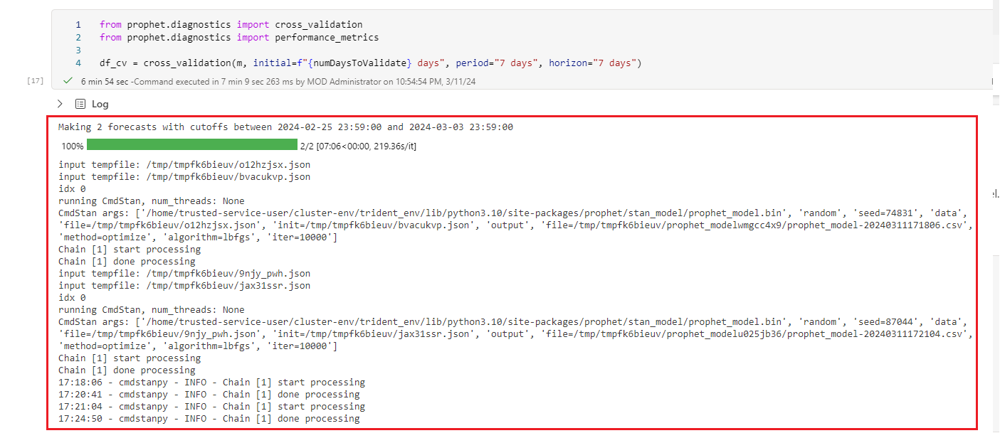

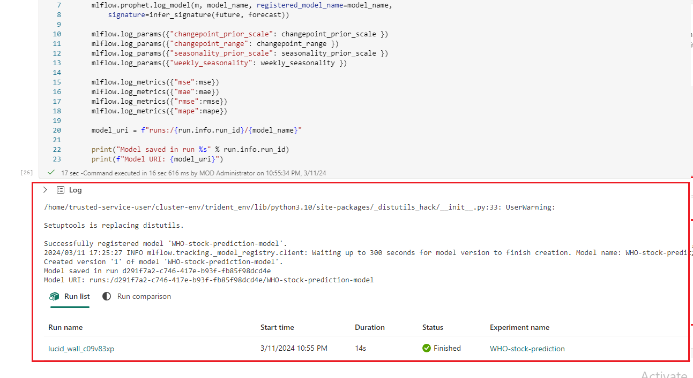

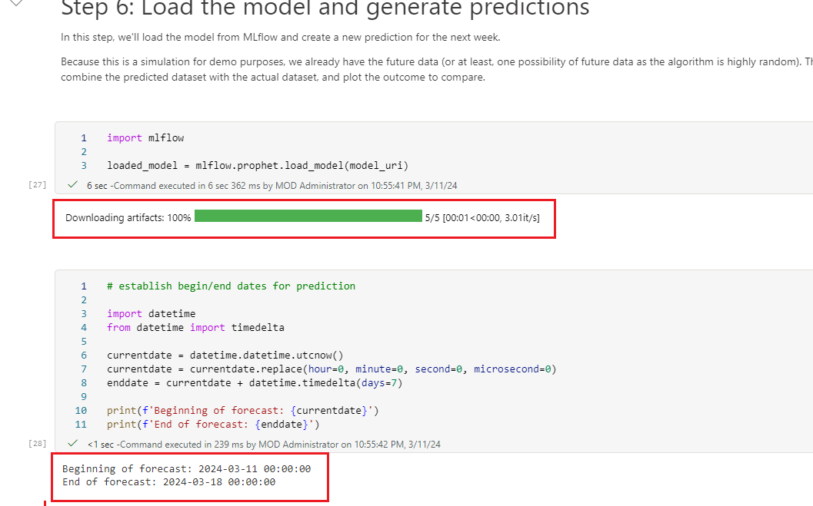

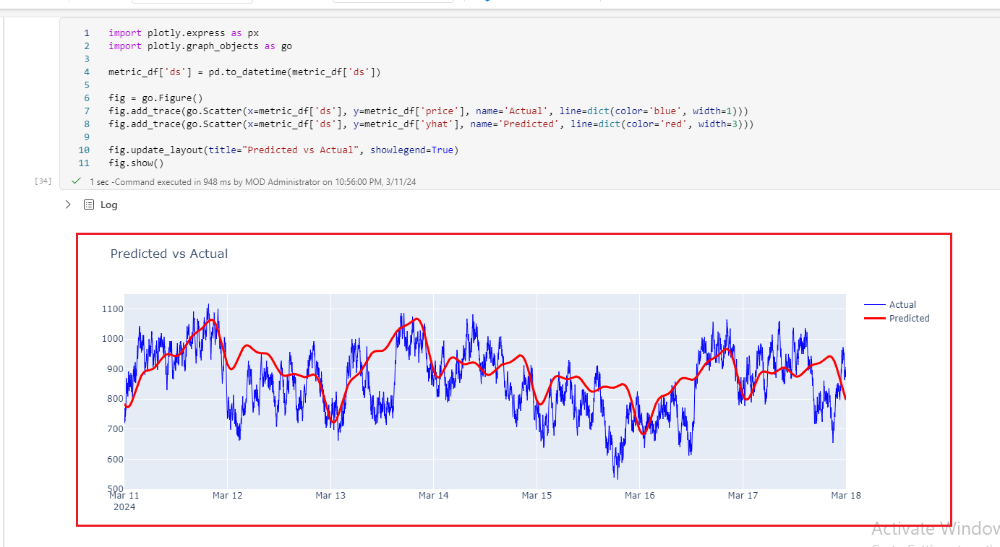

## 任務 3：檢查模型和運行

1.  現在，點擊左側導航功能表上的 **RealTimeWorkspace**。

2.  實驗和運行可在工作區資源列表中查看。

3.  在 **RealTimeWorkspace** 頁面，選擇 ML Model 類型的
    **WHO-stock-prediction-model** 。

4.  在我們的案例中，中繼資料包括我們可以調整模型的輸入參數，以及模型準確性的指標，例如均方根誤差（RMSE）。RMSE
    表示平均誤差--零表示模型與實際資料完全吻合，而數位越大則表示誤差越大。雖然數值越小越好，但
    "好 "的數值還是要根據實際情況來確定。

# 練習 2-使用模型、保存到 Lakehouse、創建報告

## 任務 1：打開並探索 "預測股票價格 "筆記本

筆記本被分解為多個函式定義，例如 *def
write_predictions*，這有助於將邏輯封裝為更小的步驟。筆記本可以包含其他庫（正如你在大多數筆記本頂部看到的那樣），也可以執行其他筆記本。本筆記本在高層次上完成了這些任務：

- 如果不存在股票預測表，則在 Lakehouse 中創建該表

- 獲取所有股票代碼列表

- 通過檢查 MLflow 中可用的 ML Model 創建預測列表

- 迴圈流覽可用的 ML Model：

  - 生成預測

  - 在 Lakehouse 存儲預測資料

1.  現在，點擊左側功能窗格中的 **RealTimeWorkspace**。

2.  在 **RealTimeWorkspace** 中，按一下 **DS 2-Predict Stock Prices**
    筆記本。

3.  在資源管理器下，選擇 **Lakehouse**，然後點擊**添加**按鈕*。*

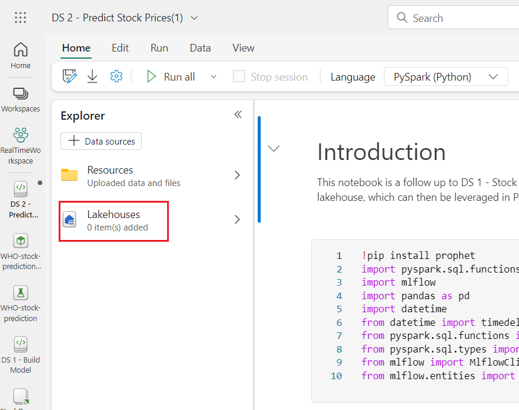

4.  在 **"添加 Lakehouse** "對話方塊中，選擇 "**現有 Lakehouse**
    "選項按鈕，然後按一下 "**添加** "按鈕。

5.  在 OneLake 資料中心視窗，選擇 ***StockLakehouse***
    並點擊**添加**按鈕。

## 任務 2：運行筆記本

1.  在 Lakehouse 中創建股票預測表，選擇並**運行** 1^(st) 和 2^(nd)
    儲存格。

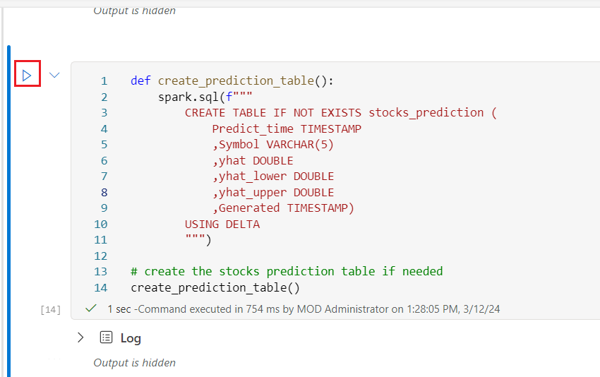

2.  獲取所有股票代碼列表，選擇並**運行** 3^(rd) 和 4^(th) 儲存格。

3.  通過檢查 MLflow 中可用的 ML Model 創建預測列表，選擇並**運行**
    7^(th) , 8^(th) , 9^(th) , 和 10^(th) 單元。

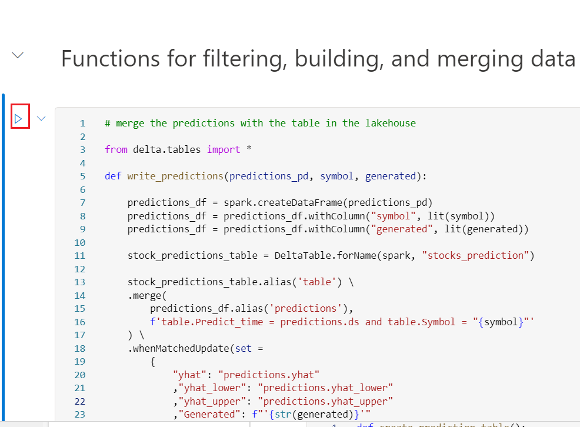

4.  要為 Lakehouse 中的每個模型商店建立預測，請選擇並**運行** 11 個^(th)
    和 12 個^(th) 單元。

5.  運行所有儲存格後，點擊*表*旁邊的三個點**（...）**刷新模式*，*然後導航並點擊***刷新*。**

# 練習 3：實際解決方案

本模組的前兩節是開發 Data Science
解決方案的常用方法。第一節涉及模型的開發（探索、特徵工程、調整等）、構建，然後部署模型。第二部分涉及模型的消費，這通常是一個獨立的過程，甚至可能由不同的團隊完成。

不過，在這種特定情況下，分別創建模型和生成預測的好處不大，因為我們開發的模型是基於時間的單變數模型--如果不使用新資料重新訓練模型，模型生成的預測結果不會發生變化。

大多數 ML Model
都是多變數的，例如，考慮一個計算兩地間旅行時間的旅行時間估算器，這樣的模型可能有幾十個輸入變數，但兩個主要變數肯定包括一天中的時間和天氣狀況。由於天氣經常變化，我們會將這些數據傳入
Data
Model，以生成新的旅行時間預測（輸入：一天中的時間和天氣，輸出：旅行時間）。

因此，我們應該在創建模型後立即生成預測結果。出於實用目的，本節將展示我們如何一步實現
ML Model 的建立和預測。這個過程將使用模組 06
中建立的聚合表，而不是使用下載的歷史資料。我們的資料流程視覺化如下

## 任務 1：導入筆記本

花點時間流覽一下 *DS 3 - 預測全功能*筆記本，注意幾個關鍵點：

- 股票資料從 stock_minute_agg 表中讀取。

- 載入所有符號，並對每個符號進行預測。

- 該常式將檢查 MLflow
  是否有匹配的模型，並載入其參數。這樣，資料科學團隊就能建立最佳參數。

- 每個種群的預測結果都會記錄到 stock_predicitions 表中。模型沒有持久性。

- 07a
  中沒有交叉驗證或其他步驟。雖然這些步驟對資料科學家很有用，但在這裡並不需要。

1.  現在，點擊左側導航功能表上的 **RealTimeWorkspace**。

2.  *在**即時工作區中***，按一下 **DS 3-Forecast All** 筆記本。

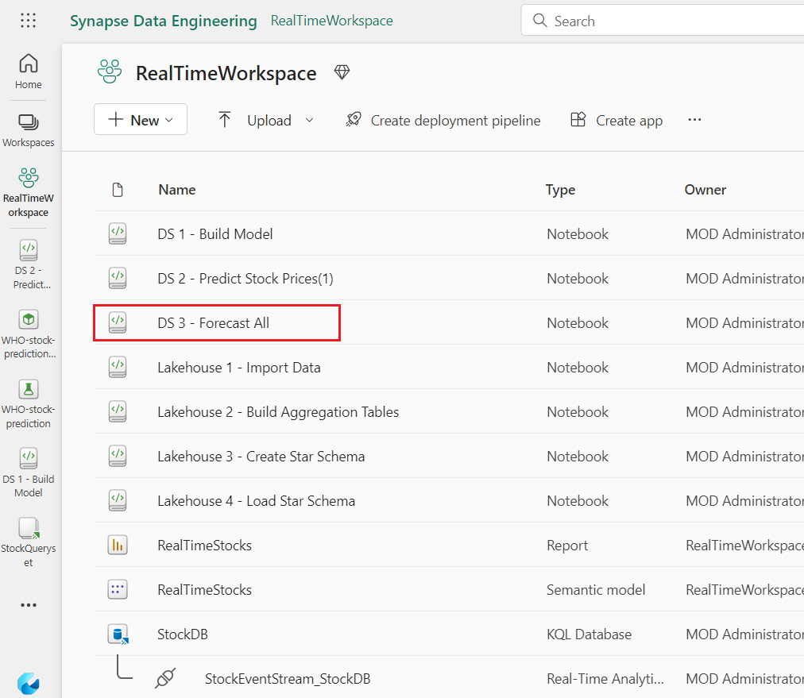

3.  在資源管理器下選擇 **Lakehouse**，然後點擊***添加 。***

4.  在 **"添加 Lakehouse** "對話方塊中，選擇 "**現有 Lakehouse**
    "選項按鈕，然後按一下 "**添加** "按鈕。

5.  在 OneLake 資料中心視窗，選擇 ***StockLakehouse***
    並點擊**添加**按鈕。

6.  選擇並**運行** 1^(st) 儲存格。

7.  按一下命令中的 "***全部運行***"，跟隨工作的進展。

8.  為所有符號運行筆記本可能需要 10 分鐘。 

9.  運行所有儲存格後，按一下*表格*右側的三個點**（...）**，然後導航並按一下
    "***刷新***"，刷新模式**。**

# 練習 4：編寫預測報告

## 任務 1：建立語義模型

在這一步中，我們將建立一個語義模型（以前稱為 Power BI 資料集），以便在
Power BI
報告中使用。語義模型代表可用于報告的資料，是資料來源之上的一個抽象概念。通常情況下，語義模型是為特定目的而構建的（服務於特定的報告需求），並可能具有轉換、關係和豐富性（如度量），從而使報告開發更輕鬆

1.  按一下左側導航菜單上的 **RealTimeWorkspace**。

2.  要創建語義模型，請導航並點擊 Lakehouse 即 **StackLakehouse。**

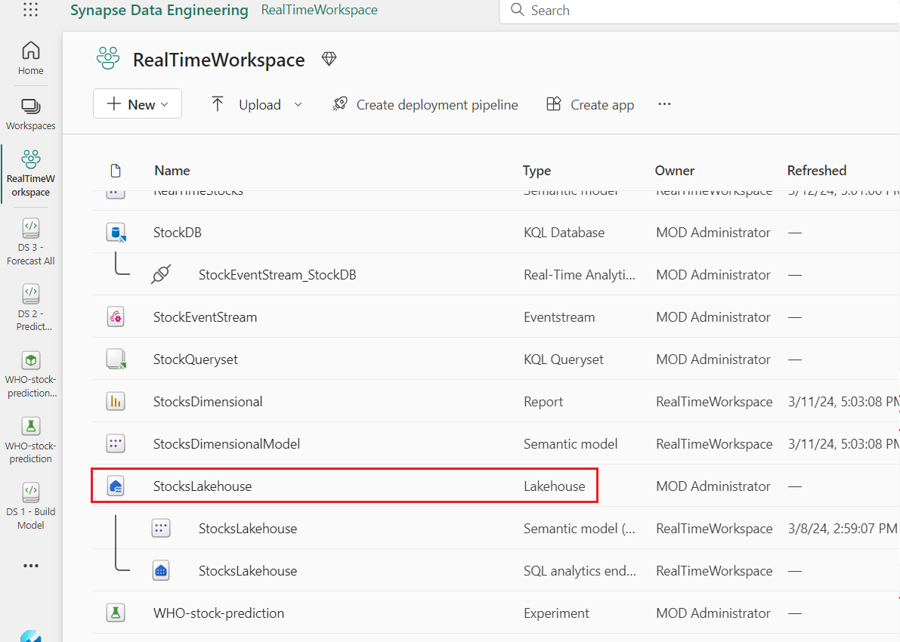

3.  在 ***StocksLakehouse*** 頁面*，*點擊命令列中的***新建語義模型***。

4.  在 "**新建語義模型** "窗格的 "**名稱** "欄位中，輸入模型名稱
    ***StocksLakehousePredictions***，選擇 **stock_prediction** 表和
    **dim_symbol** 表。然後，按一下 "**確認** "按鈕，如下圖所示。

5.  語義模型打開後，我們需要定義 stock_prediction 表和 dim_symbol
    表之間的關係。

6.  從 **stock_prediction** 表中拖動 ***Symbol* 欄位**並將其放到
    **dim_Symbol** 表中的 ***Symbol***
    欄位上，以創建關係。此時會出現**新建關係**對話方塊。

7.  在**新建關係**對話方塊中：

- **From** 表中有 **stock_prediction** 和 **Symbol** 列**。**

- 表中有 **dim_symbol** 和 **Symbol** 列**。**

- 卡性：**多對一 (\*:1)**

- 交叉過濾方向：**單**

- 選中 "**啟動此關係 "**旁邊的方框。

- 選擇**保存**

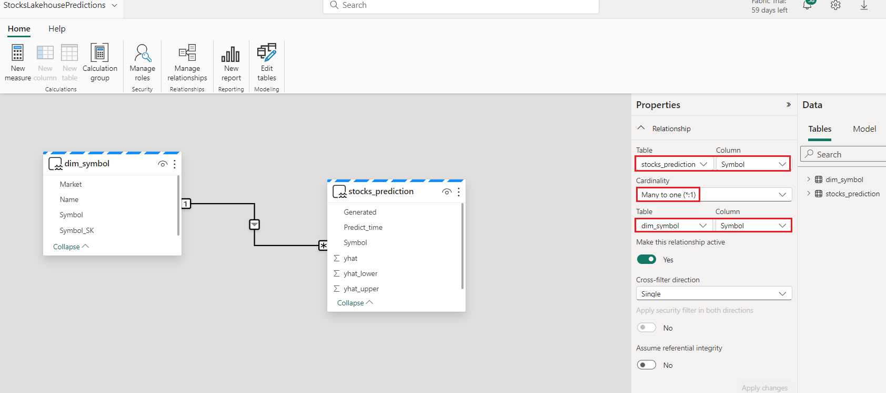

## 任務 2：在 Power BI Desktop 中構建報告

1.  打開流覽器，導航至地址欄，鍵入或粘貼以下 URL[：
    https://powerbi.microsoft.com/en-us/desktop/](https://powerbi.microsoft.com/en-us/desktop/)
    ，然後按 **Enter** 鍵。

2.  點擊**立即下載**按鈕。

> 

3.  如果出現 "**本網站正試圖打開 Microsoft Store "**對話方塊，請按一下
    "**打開 "**按鈕。

4.  在 **Power BI Desktop** 下，點擊 "**獲取** "按鈕。

5.  現在，點擊 "**打開** "按鈕。

6.  輸入 **Microsoft Office 365 租戶**憑據，然後按一下 "**下一步**
    "按鈕。

7.  從 "**資源** "選項卡中輸入**管理密碼**，然後按一下 "**登錄
    "**按鈕**。**

8.  在 Power BI Desktop 中，選擇**空白報告。**

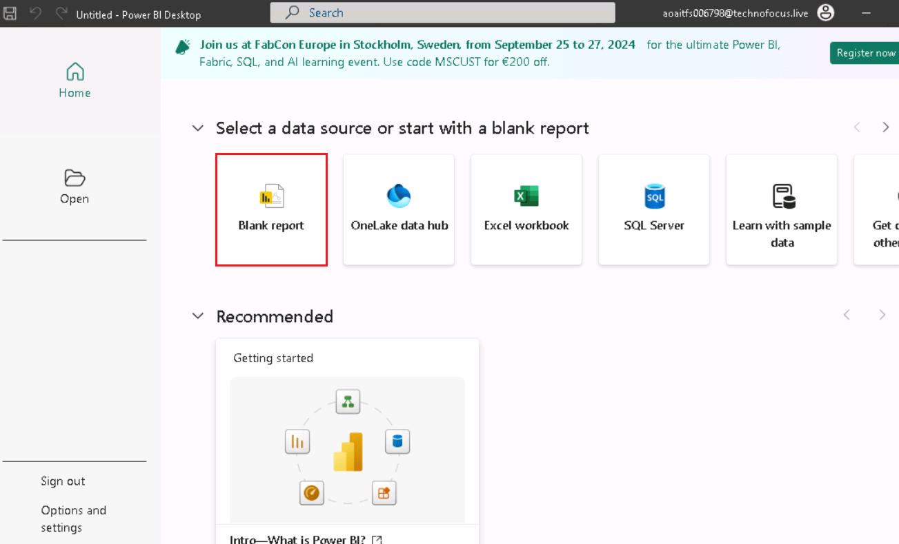

9.  在 *Home* 功能區，按一下 ***OneLake 資料集線器***並選擇 **KQL
    Database (資料庫)。**

10. 在 **OneLake 資料中心**視窗，選擇 **StockDB** 並點擊**連接**按鈕。

11. 輸入 **Microsoft Office 365** 租戶憑據，然後按一下 "**下一步**
    "按鈕。

12. 從 "**資源** "選項卡中輸入**管理密碼**，然後按一下 "**登錄
    "**按鈕**。**

13. 在導航器頁面的 "**顯示選項** "下，選擇 "**股票價格**表"，然後點擊
    "**載入** "按鈕。

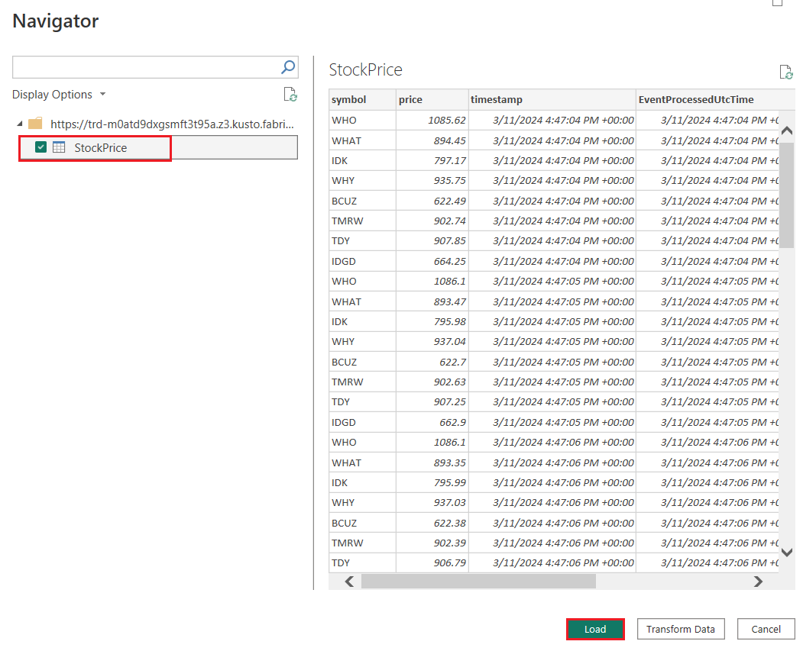

14. 在 "***連接設置*** "對話方塊中，選擇 "***直接查詢***
    "選項按鈕，然後按一下 "**確定** "按鈕。

15. 在***Home***功能區，按一下 ***OneLake 資料集線器***，然後選擇
    **Power BI 語義模型**，如下圖所示。

16. 在 **OneLake 資料中心**視窗，從清單中選擇
    **StockLakehousePredictions**，然後點擊**連接**按鈕。

17. 在 "**連接到您的資料** "頁面中，選擇
    **dim_symbol、stock_prediction**，然後點擊 "**提交** "按鈕。

18. 在這種情況下，我們可以按一下 "**確定**
    "按鈕解除**潛在安全風險**警告。

19. 按一下命令列中的***建模***，然後按一下***管理關係。***

20. 在**管理關係**窗格中，選擇 **+** 新建**關係**，如下圖所示。

21. 在 ***StockPrice*** -From **表**和 ***stocks_prediction*** - ***To
    表***之間創建**新關係**（選擇表後，確保選擇每個表中的符號列）。將交叉篩選方向設為***兩者***，並確保將卡入度設為***多對多*。**然後，按一下
    "**保存** "按鈕。

> 

22. 在 **"更改關係** "頁面，選擇 "***股票價格*** "和 ***"股票預測***
    "表，然後點擊 "**關閉** "按鈕。

23. 在 **Power BI** 頁面的 "**視覺化** "下，點擊 "**折線圖**
    "圖示，為報告添加**柱狀圖**。

- 在**資料**窗格中，展開**股票價格**，然後選中**時間戳記**旁邊的核取方塊。這將創建一個柱狀圖，並將欄位添加到
  **X 軸**。

- 在 "**資料** "**窗格**中，展開 "**股票價格**"，然後選中 "**價格**
  "旁邊的核取方塊。這將把欄位添加到 **Y 軸上**。

- 在 "**資料** "**窗格**中，展開 "**股票價格**"，然後選中 "**符號
  "**旁邊的核取方塊。這將把欄位添加到**圖例**中。

- **篩選**：**時間戳記**到***相對時間**在最近* **15 分鐘***內*。

24. 在 **Power BI** 頁面的 "**視覺化** "下，點擊 "**折線圖**
    "圖示，為報告添加**柱狀圖**。

- 在**資料**窗格中，展開**股票價格**，然後選中**時間戳記**旁邊的核取方塊。這將創建一個柱狀圖，並將欄位添加到
  **X 軸**。

- 在 "**資料** "**窗格**中，展開 "**股票價格**"，然後選中 "**價格**
  "旁邊的核取方塊。這將把欄位添加到 **Y 軸上**。

- 在**資料**窗格中，展開
  **dim_symbol**，然後選中**市場**旁邊的核取方塊。這將把欄位添加到**圖例**中。

- **篩選器**：**時間戳記**到***相對時間**在過去* **1 小時***內*。

25. 在 **Power BI** 頁面的 "**視覺化** "下，點擊 "**折線圖**
    "圖示，為報告添加**柱狀圖**。

- 在**資料**窗格中，展開 **Stock_prediction**，然後選中 **predict_time**
  旁邊的核取方塊。這將創建一個柱狀圖，並將欄位添加到 **X 軸上**。

- 在**資料**窗格中，展開 **Stock_prediction**，然後選中 **yhat**
  旁邊的核取方塊。這將把欄位添加到 **Y 軸**。

- 在**資料**窗格中，展開
  **Stock_prediction**，然後選中**符號**旁邊的核取方塊。這將把欄位添加到**圖例**中。

- **篩選器**：**predict_time** 為*最近* **3 天內***的**相對日期***。

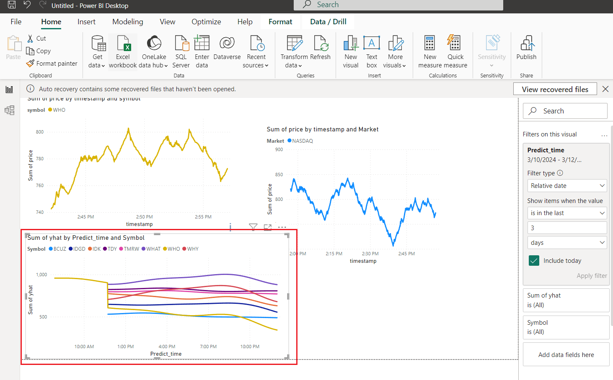

26. 在 **Power BI** 頁面的 "**資料** "下**，**右擊
    ***stocks_prediction*** 表，選擇 ***"新建措施***"***。***

27. 度量是用資料分析運算式（DAX）語言編寫的公式；對於此 DAX 公式，請輸入
    ***+++currdate = NOW()*+++++**

28. 選擇預測圖表後，導航至附加視覺化選項，即放大鏡/圖表圖示，並添加**新的
    *X 軸恒定線***。

29. 在 "*值* "下，使用公式按鈕 **(fx)** 選擇一個欄位。

30. 在 **"值"-"將設置應用於**頁面 "中，按一下
    "**我們應以哪個欄位**為**基礎？**"下的下拉式功能表，然後按一下
    "**股票預測** "下拉式功能表，選擇 "***當前日期***"。然後點擊
    "**確定** "按鈕。

31. 導航至其他視覺化選項，即放大鏡/圖表圖示，打開**陰影區域**。

32. 配置好表格之間的關係後，所有視覺效果都會交叉過濾；在圖表上選擇符號或市場時，所有視覺效果都會做出相應反應。如下圖所示，在右上角的市場圖表中選擇了**納斯達克**市場：

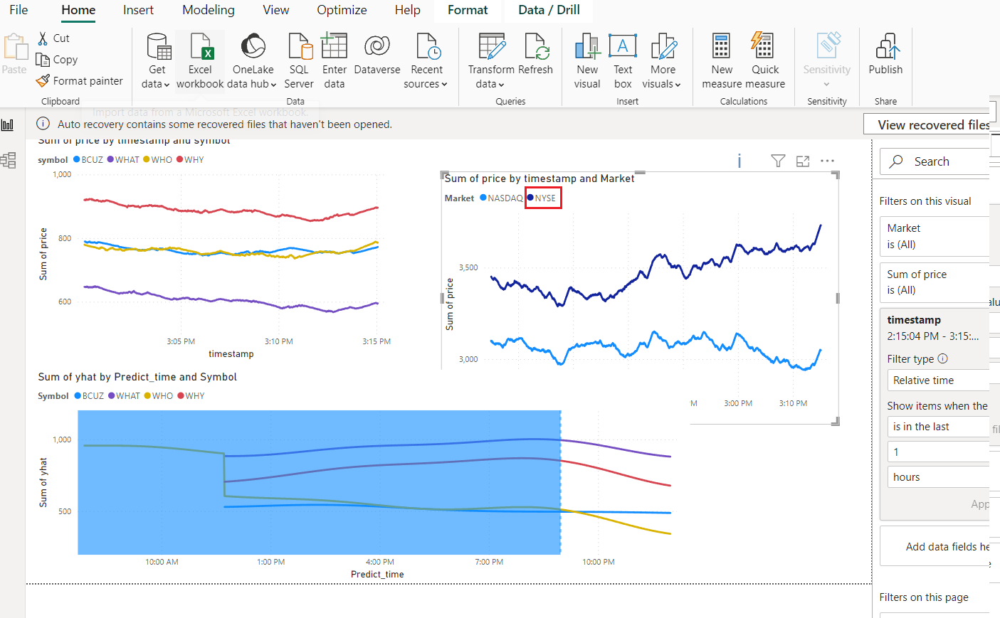

33. 點擊命令列中的 "**發佈**"。

34. 在 **Microsoft Power BI Desktop** 對話方塊中，點擊**保存**按鈕。

35. 在 **"保存此檔** "對話方塊中，輸入 "**預測報告
    "**名稱並選擇位置。然後，按一下 "**保存** "按鈕。

## **摘要**

在本實驗室中，您將學習如何通過導入和執行筆記本來處理資料、使用 Prophet
創建資料的 ML Model 並將模型存儲在 MLflow 中，從而在 Fabric
中獲得資料科學解決方案。此外，您還使用交叉驗證對模型進行了評估，並使用其他資料對模型進行了測試。

您通過消費 ML Model、生成預測並將這些預測存儲在 Lakehouse 中，跟進了 ML
Model
的創建。改進流程，在一個步驟中建立模型並生成預測，簡化了創建預測和操作模型生成的流程。然後，您創建了一份（或多份）報告，用預測值顯示當前股票價格，使業務使用者可以使用這些資料。
