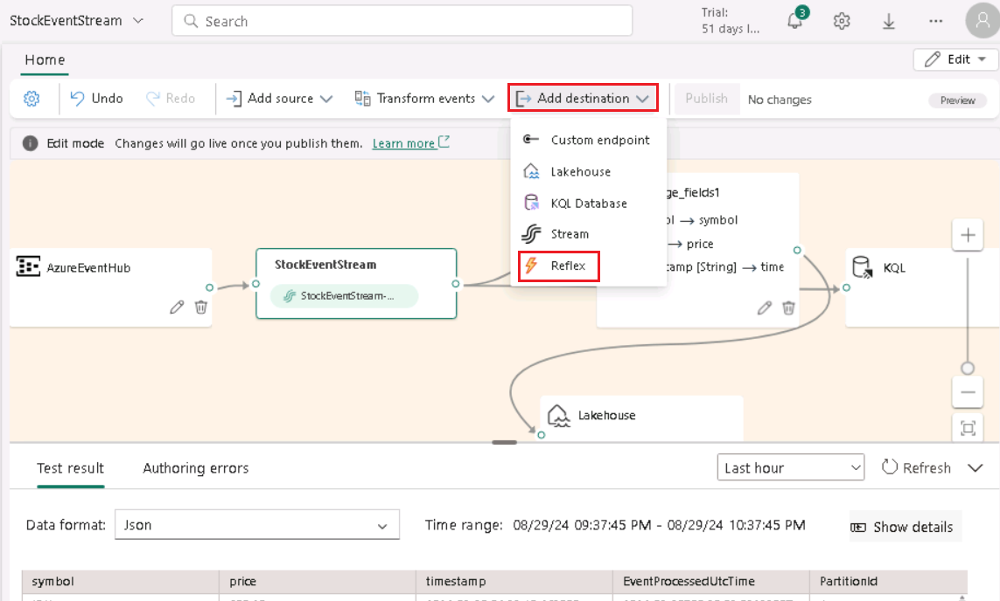
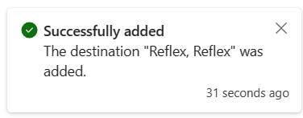
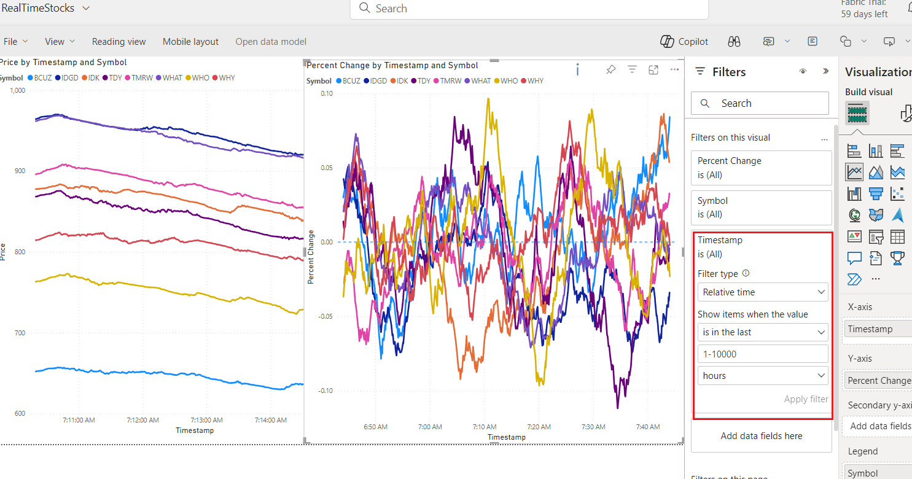
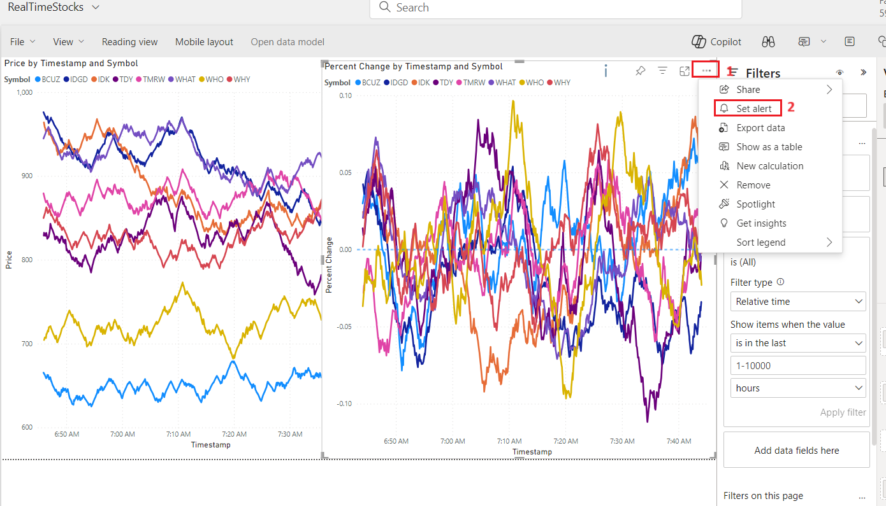
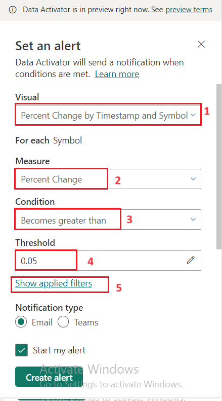
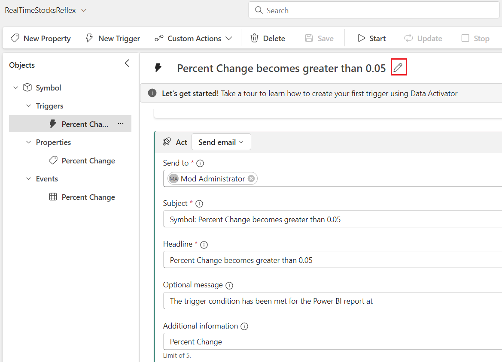
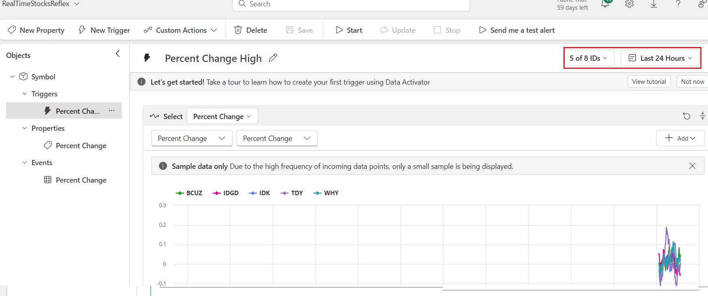
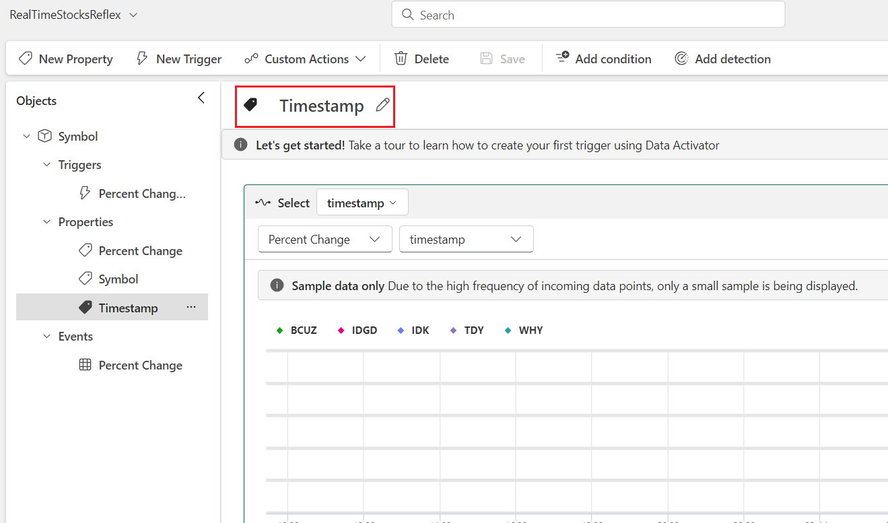
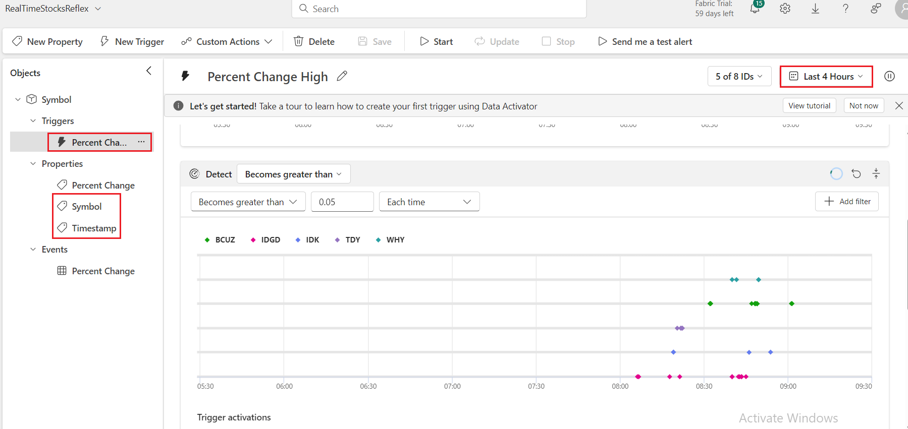

# 實驗室 06 - Data Activator（可選）

**導言**

Data Activator
是一種可觀察性工具，用於自動監控資料流程並在檢測到特定條件（或模式）時採取行動。常見用例包括監控
IoT
Devices、銷售資料、效能計數器和系統健康狀況。操作通常是通知（如電子郵件或
Teams 消息），但也可以自訂以啟動 Power Automate 工作流等。

目前，Data Activator 可以消費來自 Power BI 和 Fabric Eventstreams（如
Azure Event Hubs、Kafka 等）的數據。未來，還將添加更多資料來源（如 KQL
查詢集）和更高級的觸發功能。請閱讀 [Data Activator
路線圖](https://learn.microsoft.com/en-us/fabric/release-plan/data-activator)瞭解更多資訊。

在本實驗室中，我們將使用 Data Activator 監控 Eventstreams 和 Power BI
報告。配置 Data Activator 時，我們會設置一個或多個 *Reflexes*。Data
Activator Reflex 是保存資料連接、事件和觸發器所需全部資訊的容器。

**目標**

- 配置 Data Activator 以檢測股票符號價格的大幅上漲。

- 在 Data Activator 中設置反射，根據價格波動觸發通知。

- 利用 Eventstreams 資料即時監控和分析股價變化。

- 創建由 Power BI 報告中的條件觸發的 Data Activator Reflex。

- 自訂 Power BI 報告 Visualization，以獲得最佳可讀性並與 Data Activator
  相容。

- 在 Data Activator
  中設置閾值和配置警報，以便在資料發生重大變化時通知用戶。

# 練習 1：將 Data Activator 與 Eventstreams 結合使用

在本練習中，我們將配置 Data Activator
以檢測股票代碼價格的大幅上漲並發送通知。

## 任務 1：編寫報告

1.  在 **RealTimeStocks** 頁面上，按一下左側導航菜單上的
    **RealTimeWorkspace** 工作區。

2.  在 **RealTimeWorkspace** 窗口中，導航並按一下 **StockEventStream。**

3.  在 **Eventstreams** 上，按一下 "**編輯** "按鈕

4.  在 ***StockEventstream*** 頁面上，通過下拉式功能表 "**添加目的地**
    "**添加**新的輸出，然後選擇 ***Reflex***，如下圖所示。

> 

5.  對 Reflex 進行如下配置，然後按一下 "***保存*** "按鈕**：**

- 目的地名稱： **+++Reflex++++**

- 工作區：**RealTimeWorkspace**（或工作區名稱）

- 創建名為 **+++EventstreamReflex+++** 的新 Reflex，然後按一下 "**完成**
  "按鈕。

> 

6.  您將收到目的地 "Reflex "已**成功添加的**通知。

> 

6.  連接 **StockEventStream** 和 **Reflex。**點擊**發佈**按鈕。

> 

7.  您將收到目的地 "Reflex "已**成功發佈的**通知。

> 

8.  添加反射後，按一下頁面底部的 "***打開專案***
    "**連結*打開***反射，如下圖所示。

> 
>
> **注意**：如果您在 Reflex 狀態中看到錯誤，請等待幾分鐘並刷新頁面。
>
> 

## 任務 2：配置物件

1.  在 **StockEventStram-Reflex** 視窗的 "**分配資料**
    "窗格中輸入以下詳細資訊*。*然後點擊***保存***，選擇***保存並轉入設計模式***。

- 物件名稱 - **符號**

- 指定關鍵欄 **- 符號**

- 指定屬性 - 選擇**價格、時間戳記**

2.  保存後，Reflex 將載入。選擇屬性下的***價格***。

> 

3.  這將載入每個符號的價格屬性視圖，因為事件正在輸入。在頁面右側，點擊***添加***旁邊的下拉式功能表，然後導航並選擇***匯總*
    \> *按時間平均***，如下圖所示。

4.  將***平均時間***設置為 **10
    分鐘**。在頁面右上角，將時間視窗設置為***最後一小時***，如下圖所示。這一步將對
    10 分鐘的資料塊進行平均 - 這將有助於發現較大的價格波動。

5.  要添加新觸發器，請在頂部巡覽列中按一下 "***新建觸發器***
    "按鈕。在**未保存更改**對話方塊中，按一下**保存**按鈕。

6.  載入新觸發器頁面後，將觸發器名稱改為 "***價格上漲***"，如下圖所示。

7.  在 "價格上漲 "頁面，點擊 "**選擇屬性或事件
    "欄**旁邊的**下拉式功能表**，然後選擇 "**現有屬性** \>
    **價格**"**。**

8.  確認（並根據需要更改）右上角的時間視窗設置為 "*最後一小時"*。

9.  請注意，***價格*圖表**應保留匯總視圖，以 10 分鐘為間隔平均數據。在
    "***檢測 "***部分，將檢測類型配置為 "***數值***"\>***"增加***"。

10. 將增加類型設置為***百分比***。起始值約為
    **6**，但需要根據資料的波動性進行修改。將該值設置為***從上次測量開始***和***每次，***如下圖所示：

11. 向下滾動，按一下 "**行為** "旁邊的下拉式功能表，然後選擇
    "**電子郵件**"。然後，按一下**附加資訊**欄位中的下拉式功能表，選擇**價格**和**時間戳記**核取方塊。然後，點擊命令列中的**保存**按鈕。

12. 您將收到**已保存觸發器**的通知。

13. 然後點擊 "**向我發送測試警報**"。

**重要提示：**試用帳戶用戶不會收到通知。

# 練習 2：在 Power BI 中使用 Data Activator

在本練習中，我們將根據 Power BI 報告創建 Data Activator
Reflex。這種方法的優勢在於能夠根據更多條件觸發。當然，這可能包括來自
Eventstreams 的資料、從其他資料來源載入的資料、用 DAX
運算式增強的資料等。目前存在一個限制（隨著 Data Activator
的成熟可能會有所改變）：Data Activator 每小時監控 Power BI
報告中的資料。這可能會帶來不可接受的延遲，具體取決於資料的性質。

## 任務 1：編寫報告

對於每個報告，通過重命名來修改每個視覺化標籤。重命名顯然會讓報告在 Power
BI 中更易讀，同時也會讓它們在 Data Activator 中更易讀。

1.  現在，點擊左側導航功能表上的 **RealTimeWorkspace**。

2.  在 **RealTimeWorkspace** 窗格中，導航並按一下
    **RealTimeStocks**，如下圖所示。

3.  在 **RealTimeStock** 頁面上，按一下命令列中的 "**編輯**
    "按鈕打開報告編輯器。

4.  在修改報告時，最好暫時關閉自動刷新功能。選擇 "視覺化 "下的
    "正式頁面"，並將 "**頁面刷新** "選擇為 "**關閉"。**

5.  在 **RealTimeStock** 頁面，選擇**按時間戳記和符號計算的價格總和**。

6.  現在，選擇每個欄位的下拉式功能表，***為該視覺效果***選擇重命名，重新命名它們**。**重命名如下

- 將 *timestamp* 改為 **Timestamp**

> 
>
> 

- *價格*與*價格*之*和*

> 
>
> 

- *符號*到**符號**

> 

7.  在**即時股票**頁面，**按時間戳記和符號**選擇**百分比差 10
    分鐘之和**。

> 

8.  現在，選擇每個欄位的下拉式功能表，***為該視覺效果***選擇重命名，重新命名它們**。**重命名如下

- 將 timestamp 改為 Timestamp

- 符號到符號

- 10 分鐘百分比**變化**的平均值

9.  現在，點擊 "**篩檢程式** "部分下的 "***清除篩檢程式***
    "按鈕，暫時移除**時間戳記篩檢程式**（設置為只顯示最近 5
    分鐘的內容）。

10. Data Activator 會每小時提取一次報告資料；配置 Reflex
    時，篩檢程式也會應用到配置中。我們要確保 Reflex
    至少有一小時的資料；篩檢程式可以在 Reflex 配置後再添加。

## 任務 2：創建觸發器

我們將配置 Data Activator，以便在百分比變化值超過某個閾值（可能在 0.05
左右）時觸發警報。

1.  要創建**新的反射**和**觸發器**，請按一下**水準省略號**，導航並按一下***設置警報***，如下圖所示。

2.  在 "*設置警報 "*窗格中，大部分設置都已預選。請使用下圖所示的設置：

- 視覺化：**按時間戳記和符號分列的百分比變化**

- 衡量標準：**變化百分比**

- 條件：**大於**

- 閾值**：0.05**（稍後會更改）

- 濾鏡：**確認沒有影響視覺的濾鏡**

- 通知類型**：電子郵件**

- 取消選中 "***啟動我的警報***"，然後點擊 "***創建警報*** "按鈕。

> 
>
> 

3.  保存反射後，通知中應包含一個編輯反射的連結--按一下該連結即可打開反射。也可以從工作區專案列表中打開反射。

## 任務 3：配置反射器

1.  載入新的觸發頁面後，按一下標題上的鉛筆圖示，將標題更改為
    "***高百分比變化***"。

> 
>
> 

2.  選擇最近 24 小時。

> 

3.  接下來，為符號和時間戳記添加兩個屬性。

4.  按一下頁面左上角的 "***新建屬性***"，按一下 "選擇屬性或列 \>
    事件流或記錄中的列 \> 百分比變化 \> 符號 "旁邊的下拉式功能表。

> 
>
> 

5.  同樣，按一下
    "選擇屬性甚至列"\>"事件流或記錄中的列"\>"百分比變化"\>"**時間戳記**
    "旁邊的下拉式功能表，如下圖所示。點擊時間戳記旁邊的鉛筆圖示，將名稱更改為時間戳記。

> 
>
> 

6.  按一下物件 \> 觸發器清單下的 "百分比變化高度
    "觸發器。頂部視窗將顯示過去 4
    小時的資料，並每小時更新一次。第二個視窗定義檢測閾值。您可能需要修改該值，使其限制更多或更少。增加該值會減少檢測次數--修改該值可減少檢測次數，如下圖所示。具體數值會隨著資料波動而略有變化。

> 
>
> 
>
> 
>
> 

## 任務 4：配置通知

1.  最後，與上一個 Reflex 一樣，配置該*行為*以發送資訊。按一下
    "**附加資訊** "**欄位**，選擇 "**百分比變化**"、**"符號** "和
    "**時間**戳記"，然後按一下 "**保存 "**按鈕，如下圖所示。

> 

2.  按一下 "**向我發送測試警報**"。

> 

**重要提示：**試用帳戶用戶不會收到通知。

## **摘要**

在本實驗室中，您配置了 Data Activator
以監控股票價格變化，並根據預定義標準觸發通知。您已經設置了必要的工作區，並導航到
RealTimeStocks 頁面。然後，您在 StockEventStream 中添加了 Reflex
輸出，並將其配置為檢測價格大幅上漲。Reflex 被配置為分析 10
分鐘間隔內的價格資料，並在檢測到重大價格變化時發送電子郵件通知。您還學會了如何測試
Reflex 以確保功能正常。

然後，您創建了由 Power BI 報告中的條件觸發的 Data Activator Reflex。修改
Power BI 報告 Visualization 以確保與 Data Activator
相容，並為每個視覺化元素設置適當的標籤。然後，您在 Data Activator
中配置了警報，以便在超過特定閾值（如股票價格的顯著百分比變化）時觸發通知。此外，您還學會了如何測試
Reflex 和自訂通知內容，以包含時間戳記和符號等相關資訊。
