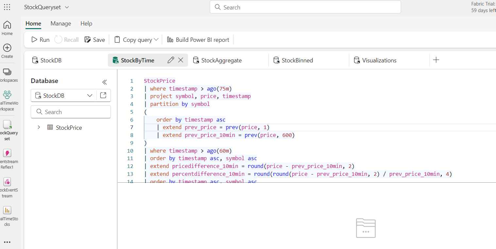
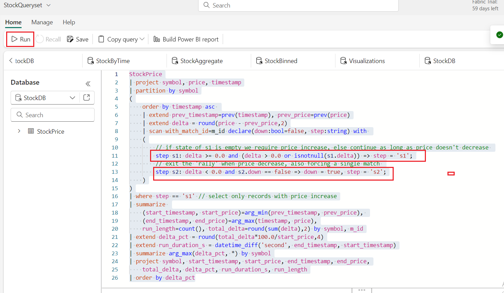

# **實驗室 07-高級 KQL** 
**導言**

在本實驗室中，您將探索更多 KQL 概念。

**目標**

- 檢查原始 KQL
  查詢的結構和執行情況，利用掃描運算子，並使用掃描運算子進行資料採擷。

- 探索應用二進位函數將資料聚合成更廣泛的組。

- 將 bin 和掃描運算器結合起來，檢查任何時間間隔內的反彈。

## 任務 1：檢查原始查詢

1.  按一下左側導航菜單上的 **RealTimeWorkspace** 工作區。

     

2.  在 **RealTimeWorkspace** 窗格中，選擇 KQL Queryset 類型的
    StockQueryset。
    
      
     
      

3.  調用原始的 **StockByTime** 查詢，選擇查詢並按一下 "**運行**
    "按鈕執行查詢。查詢成功執行後，您將看到結果。
      ```
      StockPrice
      | where timestamp > ago(75m)
      | project symbol, price, timestamp
      | partition by symbol
      (
          order by timestamp asc
          | extend prev_price = prev(price, 1)
          | extend prev_price_10min = prev(price, 600)
      )
      | where timestamp > ago(60m)
      | order by timestamp asc, symbol asc
      | extend pricedifference_10min = round(price - prev_price_10min, 2)
      | extend percentdifference_10min = round(round(price - prev_price_10min, 2) / prev_price_10min, 4)
      | order by timestamp asc, symbol asc
      ```
      

4.  該查詢同時利用了分區和前一個函數。對資料進行了分區，以確保前一個函數只考慮匹配相同符號的行。

    

## 任務 2：使用掃描運算子

我們要使用的許多查詢都需要聚合或前值形式的附加資訊。在 SQL
中，您可能還記得聚合通常是通過*分組*來完成的，而查找則可以通過*相關子查詢*來完成。KQL
沒有直接的相關子查詢，但幸運的是，它可以通過幾種方法來處理這個問題，在這種情況下，最靈活的方法是使用[分區語句](https://learn.microsoft.com/en-us/azure/data-explorer/kusto/query/partitionoperator)和[掃描操作符](https://learn.microsoft.com/en-us/azure/data-explorer/kusto/query/scan-operator)的組合。

我們已經看到，分區操作符根據指定的鍵創建子表，而掃描操作符則根據指定的謂詞匹配記錄。雖然我們只需要一個非常簡單的規則（為每個符號匹配上一行），但掃描運算子的功能非常強大，因為這些步驟和謂詞可以串聯起來。

1.  請看下面的 KQL 查詢，其結果與我們之前使用 prev() 函數的 KQL
    查詢類似：

2.  點擊視窗頂部的 "***+***"**圖示**，在查詢集內創建一個新標籤頁。

    

3.  在查詢編輯器中，複製並粘貼以下代碼。按一下**運行**按鈕執行查詢。

      複製
      ```
      StockPrice
      | where timestamp > ago(60m)
      | project timestamp, price, symbol
       ,previousprice = 0.00
       ,pricedifference = 0.00
       ,percentdifference = 0.00
      | partition hint.strategy=native by symbol
        (
          order by timestamp asc 
          | scan with (step s: true => previousprice = s.price;)
        )
      | project timestamp, symbol, price, previousprice
          ,pricedifference = round((price-previousprice),2)
          ,percentdifference = round((price-previousprice)/previousprice,4)
      | order by timestamp asc, symbol asc
      ```
      
      

4.  這個查詢的結構與我們最初的查詢類似，只是掃描操作符不再使用 prev()
    函數查看分區資料的前一行，而是可以掃描前幾行。

      

## 任務 3：通過掃描挖掘資料

掃描運算子可以包含任意數量的步驟，掃描與指定謂詞匹配的行。掃描運算子的強大之處在於，這些步驟可以將從之前步驟中學習到的狀態串聯起來。這樣，我們就可以對資料進行流程挖掘；

例如，假設我們想查找股票反彈：當股價持續上漲時，就會出現這種情況。可能是股價在短時間內大幅飆升，也可能是股價在很長一段時間內緩慢上漲。只要股價持續上漲，我們就會研究這些反彈。

1.  在上述示例的基礎上，我們首先使用 prev()
    函數獲取前一個股票價格。使用掃描運算子，第一步 (*s1*)
    查找前一個價格的漲幅。只要價格上漲，就繼續這樣做。如果股價下跌，步驟
    *s2* 就會標記*下跌*變數，從而重置狀態並結束反彈：

2.  點擊視窗頂部的 "***+***"**圖示**，在查詢集內創建一個新標籤頁。

    

3.  在查詢編輯器中，複製並粘貼以下代碼。按一下**運行**按鈕執行查詢。

      **複製**
      ```
      StockPrice
      | project symbol, price, timestamp
      | partition by symbol
      (
          order by timestamp asc 
          | extend prev_timestamp=prev(timestamp), prev_price=prev(price)
          | extend delta = round(price - prev_price,2)
          | scan with_match_id=m_id declare(down:bool=false, step:string) with 
          (
              // if state of s1 is empty we require price increase, else continue as long as price doesn't decrease 
              step s1: delta >= 0.0 and (delta > 0.0 or isnotnull(s1.delta)) => step = 's1';
              // exit the 'rally' when price decrease, also forcing a single match 
              step s2: delta < 0.0 and s2.down == false => down = true, step = 's2';
          )
      )
      | where step == 's1' // select only records with price increase
      | summarize 
          (start_timestamp, start_price)=arg_min(prev_timestamp, prev_price), 
          (end_timestamp, end_price)=arg_max(timestamp, price),
          run_length=count(), total_delta=round(sum(delta),2) by symbol, m_id
      | extend delta_pct = round(total_delta*100.0/start_price,4)
      | extend run_duration_s = datetime_diff('second', end_timestamp, start_timestamp)
      | summarize arg_max(delta_pct, *) by symbol
      | project symbol, start_timestamp, start_price, end_timestamp, end_price,
          total_delta, delta_pct, run_duration_s, run_length
      | order by delta_pct
      ```
      
     
      

4.  上面的結果是尋找反彈中漲幅最大的百分比，而不管時間長短。如果我們想查看最長的反彈，可以改變匯總方式：

5.  如下圖所示，點擊 "***+***"**圖示**，在查詢集內創建一個新標籤頁。

    

6.  在查詢編輯器中，複製並粘貼以下代碼。選擇**運行**按鈕執行查詢

      **複製**
      ```
      StockPrice
      | project symbol, price, timestamp
      | partition by symbol
      (
          order by timestamp asc 
          | extend prev_timestamp=prev(timestamp), prev_price=prev(price)
          | extend delta = round(price - prev_price,2)
          | scan with_match_id=m_id declare(down:bool=false, step:string) with 
          (
              // if state of s1 is empty we require price increase, else continue as long as price doesn't decrease 
              step s1: delta >= 0.0 and (delta > 0.0 or isnotnull(s1.delta)) => step = 's1';
              // exit the 'rally' when price decrease, also forcing a single match 
              step s2: delta < 0.0 and s2.down == false => down = true, step = 's2';
          )
      )
      | where step == 's1' // select only records with price increase
      | summarize 
          (start_timestamp, start_price)=arg_min(prev_timestamp, prev_price), 
          (end_timestamp, end_price)=arg_max(timestamp, price),
          run_length=count(), total_delta=round(sum(delta),2) by symbol, m_id
      | extend delta_pct = round(total_delta*100.0/start_price,4)
      | extend run_duration_s = datetime_diff('second', end_timestamp, start_timestamp)
      | summarize arg_max(run_duration_s, *) by symbol
      | project symbol, start_timestamp, start_price, end_timestamp, end_price,
          total_delta, delta_pct, run_duration_s, run_length
      | order by run_duration_s
      ```
      
      
## 任務 4：添加垃圾桶

在本任務中，我們將更仔細地研究一個基本的 KQL 聚合語句：[bin
函數](https://learn.microsoft.com/en-us/azure/data-explorer/kusto/query/binfunction)。*bin*
函數允許我們按照 bin
參數指定的給定大小創建分組。對於*日期時間*和*時間跨度*類型，這個功能尤其強大，因為我們可以將它與*匯總*操作符結合起來，創建更廣泛的資料視圖。

1.  例如，我們的股票資料具有每秒的精度--這對我們的即時儀錶盤很有用，但對大多數報告來說資料太多了。假設我們想將其匯總到更廣泛的組中，如天、小時甚至分鐘。此外，我們假設每天的最後一個價格（我們的資料可能是
    23:59:59）將作為我們的 "收盤價"。

2.  要獲得每天的收盤價，我們可以在之前查詢的基礎上添加一個分倉。

3.  點擊視窗頂部的 "***+***"**圖示**，在查詢集內創建一個新標籤頁。

      

4.  在查詢編輯器中，複製並粘貼以下代碼。選擇**運行**按鈕執行查詢

      **複製**
      ```
      StockPrice
      | summarize arg_max(timestamp,*) by bin(timestamp, 1d), symbol
      | project symbol, price, timestamp
      ,previousprice = 0.00
      ,pricedifference = 0.00
      ,percentdifference = 0.00
      | partition hint.strategy=native by symbol
        (
          order by timestamp asc 
          | scan with (step s output=all: true => previousprice = s.price;)
        )
      | project timestamp, symbol, price, previousprice
          ,pricedifference = round((price-previousprice),2)
          ,percentdifference = round((price-previousprice)/previousprice,4)
      | order by timestamp asc, symbol asc
      ```
      
      

5.  該查詢利用*匯總*和*二進位*語句按日和符號對資料進行分組。結果是每檔股票每天的收盤價。我們還可以根據需要添加最小/最大/平均價格，並根據需要更改分選時間。

    

## 任務 5：組合垃圾箱和掃描

1.  雖然以每秒為單位查看反彈對於我們的短時資料來說很不錯，但這可能不太現實。我們可以將反彈查詢與
    bin
    結合起來，將資料劃分為更長的時間段，從而在我們希望的任何時間段內查找反彈。

2.  點擊 "***+***"**圖示**，在查詢集內創建一個新標籤頁。

      

3.  在查詢編輯器中，複製並粘貼以下代碼。按一下**運行**按鈕執行查詢。

      **複製**
      ```
      StockPrice
      | summarize arg_max(timestamp,*) by bin(timestamp, 1m), symbol
      | project symbol, price, timestamp
      | partition by symbol
      (
          order by timestamp asc 
          | extend prev_timestamp=prev(timestamp), prev_price=prev(price)
          | extend delta = round(price - prev_price,2)
          | scan with_match_id=m_id declare(down:bool=false, step:string) with 
          (
              // if state of s1 is empty we require price increase, else continue as long as price doesn't decrease 
              step s1: delta >= 0.0 and (delta > 0.0 or isnotnull(s1.delta)) => step = 's1';
              // exit the 'rally' when price decrease, also forcing a single match 
              step s2: delta < 0.0 and s2.down == false => down = true, step = 's2';
          )
      )
      | where step == 's1' // select only records with price increase
      | summarize 
          (start_timestamp, start_price)=arg_min(prev_timestamp, prev_price), 
          (end_timestamp, end_price)=arg_max(timestamp, price),
          run_length=count(), total_delta=round(sum(delta),2) by symbol, m_id
      | extend delta_pct = round(total_delta*100.0/start_price,4)
      | extend run_duration_s = datetime_diff('second', end_timestamp, start_timestamp)
      | summarize arg_max(delta_pct, *) by symbol
      | project symbol, start_timestamp, start_price, end_timestamp, end_price,
          total_delta, delta_pct, run_duration_s, run_length
      | order by delta_pct
      
      ```
      
      
      

## **摘要**

本實驗室旨在加強您對在 RealTimeWorkspace 環境中使用 KQL (Kusto Query
Language，KQL) 的理解和熟練程度，重點是分析股票價格資料的高級技術。

在本實驗室中，您執行了原始的 StockByTime
查詢，該查詢使用分區和前一個函數來分析股票價格隨時間的變化。然後，使用掃描運算子替代
prev()
函數。您使用掃描運算子進行了資料採擷，以識別股票反彈，展示了它在檢測資料中特定模式方面的靈活性。

您已經瞭解了 bin 函數，這是一種基本的 KQL
聚合語句，用於根據指定的時間間隔將股票資料聚合到更廣泛的組中。然後，您還結合了
bin
和掃描操作符，將資料歸類到更長的時間段，以便於識別任何所需的時間間隔內的反彈。您已經獲得了結合多個
KQL 操作符對股票價格資料集執行綜合分析任務的實踐經驗。
