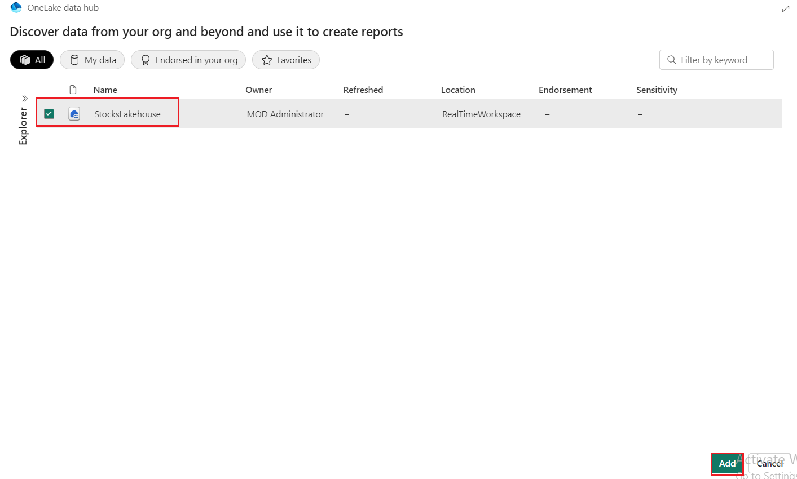

**實驗室 08-三角洲檔維護**

**導言**

將即時資料導入 Data Lakehouse 時，Delta 表往往分佈在許多小的 Parquet
Files 文件中。由於引入了大量 I/O
開銷，許多小檔會導致查詢運行速度變慢，這就是人們常說的
"小文件問題"。本模組將介紹如何優化 Delta 表。

**目標**

- 在 Delta Lake 中執行小檔案壓縮。

## 練習 1：小檔案壓縮

隨著 Eventstreams 不斷向 Lakehouse
寫入資料，每天將生成數千個檔，影響運行查詢時的整體性能。在運行筆記本時，你可能會看到診斷引擎發出警告，提示表可能受益於小檔案壓縮，這是一個將許多小檔合併為較大檔的過程。

1.  按一下左側導航菜單上的 **RealTimeWorkspace**。

    

2.  Delta Lake 使執行小檔案壓縮變得非常容易，可以在 Spark SQL、Python 或
    Scala 中執行。*raw_stock_data*
    表是需要日常維護的主要表，但所有表都應根據需要進行監控和優化。

3.  要使用 Python 壓縮小文件，請在 **Synapse Data Engineering**
    工作區頁面中，導航並按一下 **+New** 按鈕，然後選擇**筆記本。**

     

4.  在資源管理器下，選擇 **Lakehouse**，然後點擊**添加**按鈕。

      
     
      

5.  在 **"添加 Lakehouse** "對話方塊中，選擇 "**現有 Lakehouse**
    "選項按鈕，然後按一下 "**添加** "按鈕。

     

6.  在 **OneLake 資料中心**視窗，選擇 ***StockLakehouse***
    並點擊**添加**按鈕。
   

7.  在查詢編輯器中，複製並粘貼以下代碼。選擇並**運行**儲存格以執行查詢。查詢成功執行後，您將看到結果。
    ```
    from delta.tables import *
    raw_stock_data = DeltaTable.forName (spark, "raw_stock_data”)
    raw_stock_data.optimize().executeCompaction()
    ```
     

    

8.  通過導航到 Fabric 工作區中的
    Lakehouse，然後按一下表名右側的省略號並選擇*維護*，即可臨時運行小檔案壓縮。

9.  使用儲存格輸出下方的 **+ 代碼圖示**添加以下代碼，並使用儲存格左側的
    **▷ 運行**儲存格按鈕來運行它。

      
    ``` 
    from delta.tables import *
    
    if spark.catalog.tableExists("dim_date"):
        table = DeltaTable.forName(spark, "dim_date")
        table.optimize().executeCompaction()
    
    if spark.catalog.tableExists("dim_symbol"):
        table = DeltaTable.forName(spark, "dim_symbol")
        table.optimize().executeCompaction()
    
    if spark.catalog.tableExists("fact_stocks_daily_prices"):
        table = DeltaTable.forName(spark, "fact_stocks_daily_prices")
        table.optimize().executeCompaction()
    
    if spark.catalog.tableExists("raw_stock_data"):
        table = DeltaTable.forName(spark, "raw_stock_data")
        table.optimize().executeCompaction()
        table.vacuum()
    ```
   
 
  *raw_stock_data*
> 表的優化時間最長，也最需要定期優化。此外，請注意*真空*的使用。*vacuum*
> 命令會刪除超過保留期（默認為 7
> 天）的文件。雖然刪除舊檔對性能影響不大（因為它們已不再使用），但它們會增加存儲成本，並可能對處理這些檔案備份等工作造成影響。

## **摘要**

在本實驗中，您使用 Python 在 Synapse Data Engineering
工作區內執行了小檔案壓縮。
